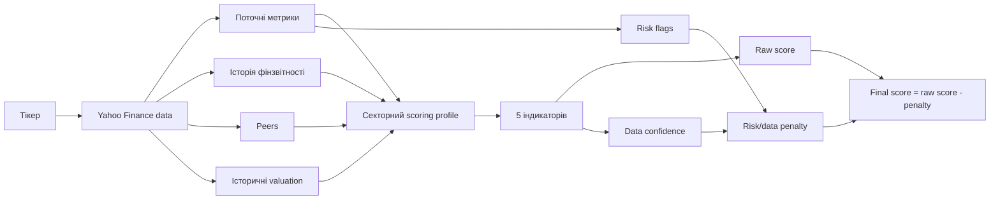
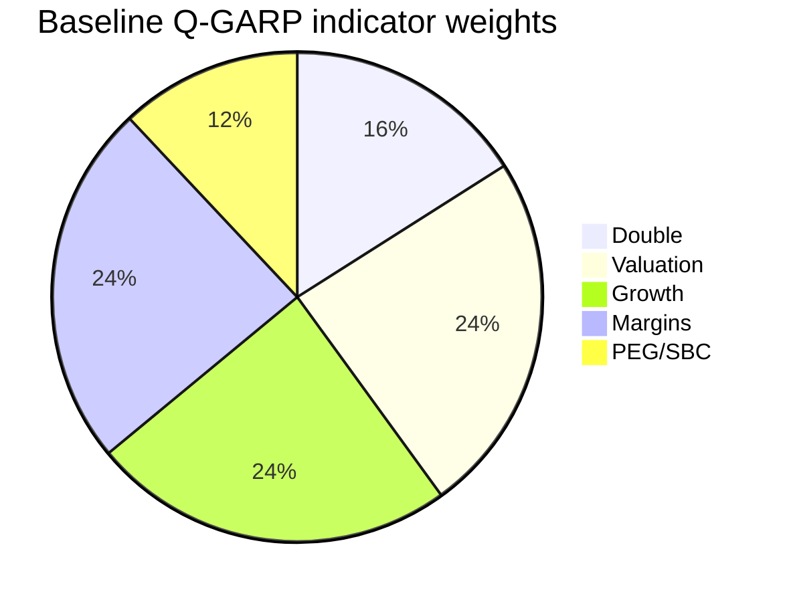
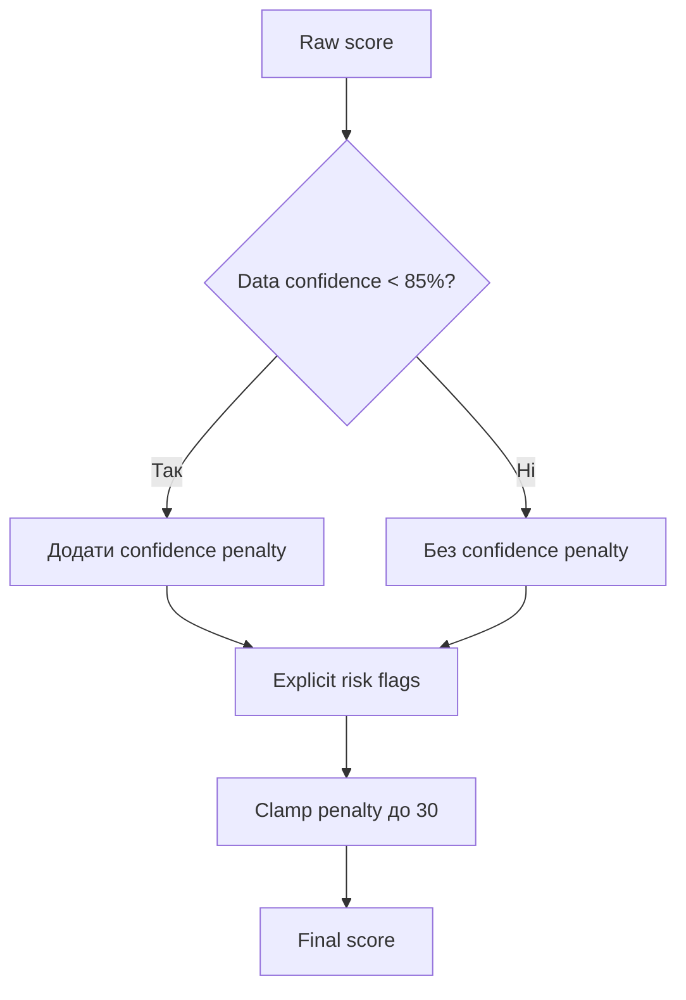

# Q-GARP Methodology

Цей документ описує методологію скорингу в застосунку Q-GARP Framework. Мета
скорингу - швидко відсіяти компанії за профілем quality growth at a reasonable
price, а не замінити повний інвестиційний аналіз.

Скоринг використовує дані Yahoo Finance через `yahoo-finance2`: quote summary,
financial statements, cash flow, balance sheet, рекомендації peers, SPY як
ринковий орієнтир і історичні ціни для побудови історичних valuation-мультиплікаторів.

## 1. Загальна логіка



Фінальний результат складається з:

- `rawScore` - вагове середнє п'яти індикаторів до штрафів.
- `confidence` - наскільки повно доступні дані для розрахунку.
- `riskPenalty` - штраф за низьку довіру до даних і явні ризики.
- `score` - фінальний бал від 0 до 100.
- `riskFlags` - короткий список причин, які знизили оцінку.

## 2. Основна формула

Кожен індикатор складається з набору сигналів. Сигнал має бал `s_i` і вагу
`w_i`. Якщо сигнал недоступний, він не ігнорується повністю: замість нього
підставляється штрафний missing score.

```text
indicatorScore = round(sum(score_i * weight_i) / sum(weight_i))
indicatorConfidence = observedSignalWeight / totalSignalWeight
```

Missing data:

- звичайний відсутній сигнал: `42/100`;
- критично відсутній сигнал: `28/100`;
- confidence рахується тільки за реально доступними сигналами.

Фінальна оцінка:

```text
rawScore = weightedAverage(indicatorScore, profileIndicatorWeights)
confidence = weightedAverage(indicatorConfidence, profileIndicatorWeights)
confidencePenalty = confidence < 85% ? round((0.85 - confidence) * 18) : 0
riskPenalty = clamp(explicitRiskPenalty + confidencePenalty, 0, 30)
score = clamp(round(rawScore - riskPenalty), 0, 100)
```

Тон оцінки:

| Tone | Умова |
| --- | --- |
| `good` | `score >= 70` і `confidence >= 55%` |
| `watch` | `score >= 45` |
| `bad` | `score < 45` |
| `unknown` | `confidence <= 15%` |

## 3. Scoring profiles

Профіль обирається автоматично за `sector` та `industry`. Він змінює ваги
індикаторів і пороги для росту, маржинальності та боргу.

### Ваги індикаторів

| Profile | Double | Valuation | Growth | Margins | PEG/SBC |
| --- | ---: | ---: | ---: | ---: | ---: |
| Baseline Q-GARP | 16% | 24% | 24% | 24% | 12% |
| Financials | 10% | 30% | 17% | 31% | 12% |
| Tech / software | 18% | 20% | 27% | 22% | 13% |
| Cyclical | 10% | 29% | 18% | 28% | 15% |
| Defensive | 10% | 27% | 18% | 30% | 15% |



### Growth thresholds

У таблиці формат `watch / good`.

| Profile | Revenue growth | FCF growth | Earnings growth |
| --- | ---: | ---: | ---: |
| Baseline | 8% / 16% | 6% / 14% | 7% / 15% |
| Financials | 3% / 8% | 2% / 6% | 4% / 10% |
| Tech / software | 10% / 22% | 7% / 18% | 8% / 18% |
| Cyclical | 3% / 10% | 3% / 10% | 4% / 12% |
| Defensive | 3% / 9% | 3% / 9% | 4% / 10% |

### Margin and leverage thresholds

У таблиці формат `watch / good`, крім leverage, де формат `good / watch`
бо нижче значення краще.

| Profile | Gross margin | Operating margin | Profit margin | FCF margin | ROE | ROIC proxy | Debt/equity | Net debt/FCF |
| --- | ---: | ---: | ---: | ---: | ---: | ---: | ---: | ---: |
| Baseline | 30% / 55% | 8% / 20% | 5% / 15% | 4% / 12% | 10% / 22% | 8% / 18% | 0.6x / 1.8x | 1.5x / 4.0x |
| Financials | n/a | 5% / 15% | 10% / 25% | n/a | 10% / 18% | n/a | 2.5x / 8.0x | 3.0x / 8.0x |
| Tech / software | 45% / 70% | 8% / 24% | 4% / 18% | 5% / 18% | 12% / 26% | 10% / 24% | 0.6x / 1.8x | 1.5x / 4.0x |
| Cyclical | 20% / 38% | 6% / 16% | 4% / 12% | 3% / 10% | 10% / 22% | 8% / 18% | 0.8x / 2.2x | 2.0x / 5.0x |
| Defensive | 22% / 45% | 6% / 18% | 4% / 14% | 4% / 12% | 10% / 22% | 8% / 18% | 0.6x / 1.8x | 1.5x / 4.0x |

## 4. П'ять індикаторів

### 4.1. Double: подвоєння за 5 років

Цільовий CAGR для подвоєння:

```text
DOUBLE_CAGR = 2^(1/5) - 1 = 14.87%
```

Сигнали:

| Signal | Weight | Critical |
| --- | ---: | --- |
| Revenue CAGR 3y | 1.25 | Так |
| Net income CAGR 3y | 1.05 | Так |
| FCF CAGR 3y | 1.00, або 0.25 для Financials | Так, крім Financials |
| Forward revenue growth | 0.55 | Ні |
| Forward earnings growth | 0.70 | Ні |

Оцінка темпу росту:

```text
if growth < 0: 8
if growth >= 125% of target: 100
if growth >= target: 86..100
if growth >= 65% of target: 55..86
if growth >= 35% of target: 28..55
else: 12..28
```

### 4.2. Valuation: ціна проти ринку, peers та історії

Основна ідея: нижчий мультиплікатор за релевантний benchmark корисний, але
негативний прибуток або FCF не дозволяє компанії виглядати "дешевою" без штрафу.

Сигнали:

| Signal | Weight |
| --- | ---: |
| Trailing P/E vs SPY P/E | 0.70 |
| Trailing P/E vs peer median P/E | 1.00 |
| Forward P/E vs peer median forward P/E | 0.80 |
| Trailing P/E vs historical median P/E | 0.85 |
| P/S vs historical median P/S | 0.75, або 0.20 для Financials |
| P/S vs peer median P/S | 0.60, або 0.16 для Financials |
| P/FCF vs historical median P/FCF | 1.00, або 0.25 для Financials |
| EV/EBITDA vs peer median EV/EBITDA | 0.70, не використовується для Financials |
| P/B vs peer median P/B | 1.00 для Financials, 0.55 для Cyclical, 0.25 для інших |
| Absolute P/B для Financials | 0.80 |
| Positive/negative net income | 0.70 |
| Positive/negative FCF | 0.85, не використовується для Financials |

Формула discount signal:

```text
discount = (benchmark - value) / benchmark

discount >= 25%       -> 100
discount 5%..25%      -> 74..94
discount -10%..5%     -> 52..74
discount -30%..-10%   -> 28..52
lower                 -> 10
```

### 4.3. Growth: ріст проти конкурентів і власної історії

Сигнали:

| Signal | Weight | Critical |
| --- | ---: | --- |
| Revenue YoY vs peer revenue growth | 0.90 | Ні |
| Earnings YoY vs peer earnings growth | 0.75 | Ні |
| Forward revenue growth vs peer revenue growth | 0.55 | Ні |
| Revenue CAGR 3y vs profile threshold | 1.15 | Так |
| Net income CAGR 3y vs profile threshold | 0.80 | Ні |
| FCF CAGR 3y vs profile threshold | 1.00, або 0.25 для Financials | Так, крім Financials |
| Forward revenue growth vs profile threshold | 0.55 | Ні |
| Forward earnings growth vs profile threshold | 0.60 | Ні |

Peer premium signal:

```text
premium = companyGrowth - peerMedianGrowth

premium >= +10 pp  -> 100
premium >= +3 pp   -> 78
premium >= -2 pp   -> 56
premium >= -8 pp   -> 36
else               -> 14
```

### 4.4. Margins: якість росту, прибутковість і leverage

Сигнали:

| Signal | Weight |
| --- | ---: |
| Gross margin change 3y | grossWeight * 0.45 |
| Operating margin change 3y | operatingWeight * 0.55 |
| Net margin change 3y | 0.55 |
| Current gross margin | grossWeight |
| Current operating margin | operatingWeight |
| Current profit margin | 1.00 |
| Current FCF margin | fcfWeight |
| Profit margin vs peer median | 0.70 |
| ROE vs peer median | 0.45 |
| ROE vs profile threshold | 0.75 |
| ROIC proxy vs profile threshold | roicWeight |
| Debt/equity | leverageWeight |
| Net debt/FCF | 0.50, не використовується для Financials |
| Revenue growth floor | 0.35 |

Ваги всередині margins залежать від профілю:

- Financials: gross margin і ROIC proxy майже не використовуються, FCF має малу вагу.
- Tech/software: gross margin важливіший.
- Non-financials: FCF margin, debt/equity і net debt/FCF мають суттєву вагу.

### 4.5. PEG/SBC: growth at reasonable price після компенсацій

Базовий PEG:

```text
basePeg = Yahoo PEG
or
basePeg = forwardPE / (growthForPeg * 100)
```

SBC adjustment:

```text
adjustedFcf = trailingFcf - stockBasedCompensation
adjustment = trailingFcf / adjustedFcf
adjustedPeg = basePeg * adjustment
```

Сигнали:

| Signal | Weight | Critical |
| --- | ---: | --- |
| Adjusted PEG | 1.15 | Так |
| Growth used for PEG | 0.65 | Так |
| SBC / revenue | 0.75 | Ні |
| SBC / FCF | 0.85, або 0.20 для Financials | Ні |
| Positive/negative trailing FCF | 0.85, або 0.20 для Financials | Так, крім Financials |
| Positive/negative FCF after SBC | 0.85, або 0.20 для Financials | Так, крім Financials |

PEG signal:

```text
PEG < 1.0   -> 100
PEG < 1.4   -> 70
PEG < 2.0   -> 42
else        -> 14
```

## 5. Risk/data penalty

Risk flags знижують фінальний score після розрахунку `rawScore`. Це зроблено
навмисно: компанія не повинна отримувати високий фінальний бал тільки тому, що
частина проблемних даних відсутня або не потрапила в окремий індикатор.



Explicit risk flags:

| Risk flag | Penalty |
| --- | ---: |
| Data confidence нижче 55% | +4 |
| Yahoo peer group не перевірена вручну | +2 |
| Немає peer comparison | +5 |
| Менше 3 років annual financials | +3 |
| Немає cash flow/SBC | +4, або +1 для Financials |
| Немає TTM financials | +3 |
| Немає historical valuation | +3 |
| Net income <= 0 | +8 |
| FCF <= 0 для non-financials | +8 |
| FCF after SBC <= 0 для non-financials | +6 |
| SBC / revenue > 10% | +7 |
| SBC / revenue 5%..10% | +3 |
| Stockholders equity <= 0 | +8 |
| Debt/equity вище watch threshold для non-financials | +6 |
| Net debt/FCF вище watch threshold для non-financials | +5 |

Explicit risk penalty обмежується `26`, після чого додається confidence penalty.
Загальний `riskPenalty` обмежується `30`.

## 6. Як читати фінальний score

| Score | Інтерпретація |
| ---: | --- |
| 70-100 | Сильний Q-GARP профіль, якщо confidence достатній |
| 45-69 | Змішаний профіль: потрібна ручна перевірка драйверів і ризиків |
| 0-44 | Слабкий профіль для Q-GARP підходу |

Важливо читати не тільки `score`, а й:

- `rawScore` - що модель думала до штрафів;
- `confidence` - чи достатньо даних;
- `riskPenalty` - наскільки оцінка була знижена;
- `riskFlags` - чому саме;
- peer group - рекомендована Yahoo-група є тільки стартовим наближенням.

## 7. Обмеження методології

- Yahoo Finance може повертати неповні або нестабільні дані.
- Peer-групу бажано перевіряти вручну: бізнес-модель, географія, розмір,
  маржинальність і стадія розвитку мають бути співставними.
- Модель не враховує якісний аналіз менеджменту, moat, регуляторні ризики,
  концентрацію клієнтів, циклічний пік/дно, одноразові статті та якість прогнозів.
- Секторні профілі є евристикою, а не backtested investment model.
- Score є research helper, не інвестиційна рекомендація.
