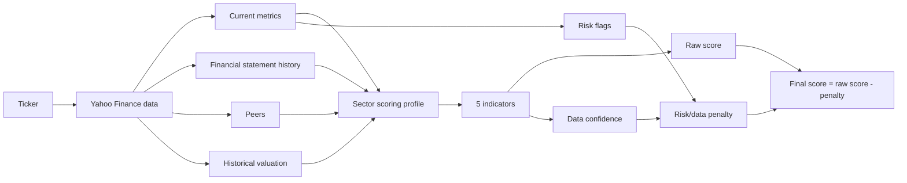
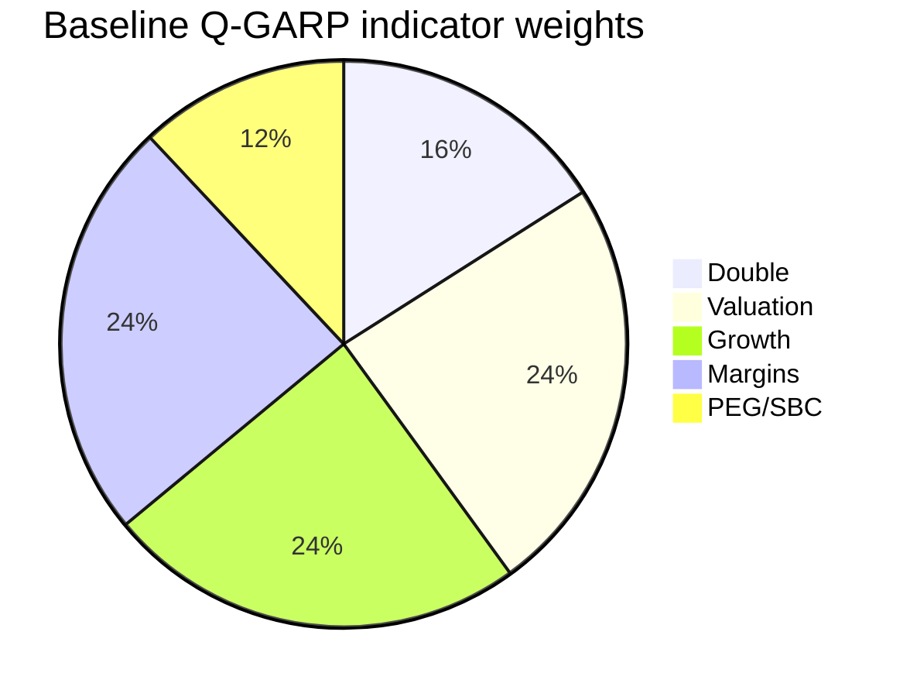
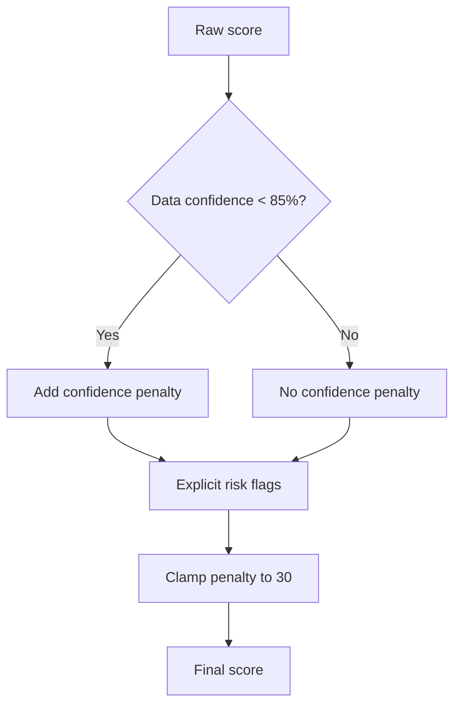

# Q-GARP Methodology

This document describes the scoring methodology used by the Q-GARP Framework.
The goal is to quickly screen public companies for a quality growth at a
reasonable price profile. The score is a research helper, not a replacement for
full investment analysis.

The model uses Yahoo Finance data through `yahoo-finance2`: quote summary,
financial statements, cash flow, balance sheet, peer snapshots, SPY as a
market benchmark, and historical prices for building historical valuation
multiples.

## 1. Overview



The final result consists of:

- `rawScore` - the weighted average of the five indicators before penalties.
- `confidence` - how complete the available data is for the calculation.
- `riskPenalty` - a penalty for low data confidence and explicit risks.
- `score` - the final 0-100 score.
- `riskFlags` - a short list of issues that reduced the score.

## 2. Core Formula

Each indicator is built from a set of signals. A signal has a score `s_i` and a
weight `w_i`. If a signal is unavailable, it is not silently ignored: the model
uses a missing-data score instead.

```text
indicatorScore = round(sum(score_i * weight_i) / sum(weight_i))
indicatorConfidence = observedSignalWeight / totalSignalWeight
```

Missing data:

- regular missing signal: `42/100`;
- critical missing signal: `28/100`;
- confidence is calculated only from signals that were actually observed.

Final score:

```text
rawScore = weightedAverage(indicatorScore, profileIndicatorWeights)
confidence = weightedAverage(indicatorConfidence, profileIndicatorWeights)
confidencePenalty = confidence < 85% ? round((0.85 - confidence) * 18) : 0
riskPenalty = clamp(explicitRiskPenalty + confidencePenalty, 0, 30)
score = clamp(round(rawScore - riskPenalty), 0, 100)
```

Score tone:

| Tone | Condition |
| --- | --- |
| `good` | `score >= 70` and `confidence >= 55%` |
| `watch` | `score >= 45` |
| `bad` | `score < 45` |
| `unknown` | `confidence <= 15%` |

## 3. Scoring Profiles

The scoring profile is selected automatically from `sector` and `industry`. It
changes indicator weights and thresholds for growth, margins, and leverage.

### Indicator weights

| Profile | Double | Valuation | Growth | Margins | PEG/SBC |
| --- | ---: | ---: | ---: | ---: | ---: |
| Baseline Q-GARP | 16% | 24% | 24% | 24% | 12% |
| Financials | 10% | 30% | 17% | 31% | 12% |
| Tech / software | 18% | 20% | 27% | 22% | 13% |
| Cyclical | 10% | 29% | 18% | 28% | 15% |
| Defensive | 10% | 27% | 18% | 30% | 15% |



### Growth thresholds

The table uses the `watch / good` format.

| Profile | Revenue growth | FCF growth | Earnings growth |
| --- | ---: | ---: | ---: |
| Baseline | 8% / 16% | 6% / 14% | 7% / 15% |
| Financials | 3% / 8% | 2% / 6% | 4% / 10% |
| Tech / software | 10% / 22% | 7% / 18% | 8% / 18% |
| Cyclical | 3% / 10% | 3% / 10% | 4% / 12% |
| Defensive | 3% / 9% | 3% / 9% | 4% / 10% |

### Margin and leverage thresholds

The table uses the `watch / good` format, except for leverage metrics, where the
format is `good / watch` because lower values are better.

| Profile | Gross margin | Operating margin | Profit margin | FCF margin | ROE | ROIC proxy | Debt/equity | Net debt/FCF |
| --- | ---: | ---: | ---: | ---: | ---: | ---: | ---: | ---: |
| Baseline | 30% / 55% | 8% / 20% | 5% / 15% | 4% / 12% | 10% / 22% | 8% / 18% | 0.6x / 1.8x | 1.5x / 4.0x |
| Financials | n/a | 5% / 15% | 10% / 25% | n/a | 10% / 18% | n/a | 2.5x / 8.0x | 3.0x / 8.0x |
| Tech / software | 45% / 70% | 8% / 24% | 4% / 18% | 5% / 18% | 12% / 26% | 10% / 24% | 0.6x / 1.8x | 1.5x / 4.0x |
| Cyclical | 20% / 38% | 6% / 16% | 4% / 12% | 3% / 10% | 10% / 22% | 8% / 18% | 0.8x / 2.2x | 2.0x / 5.0x |
| Defensive | 22% / 45% | 6% / 18% | 4% / 14% | 4% / 12% | 10% / 22% | 8% / 18% | 0.6x / 1.8x | 1.5x / 4.0x |

## 4. The Five Indicators

### 4.1. Double: five-year doubling pace

Target CAGR required to double over five years:

```text
DOUBLE_CAGR = 2^(1/5) - 1 = 14.87%
```

Signals:

| Signal | Weight | Critical |
| --- | ---: | --- |
| Revenue CAGR 3y | 1.25 | Yes |
| Net income CAGR 3y | 1.05 | Yes |
| FCF CAGR 3y | 1.00, or 0.25 for Financials | Yes, except Financials |
| Forward revenue growth | 0.55 | No |
| Forward earnings growth | 0.70 | No |

Growth pace scoring:

```text
if growth < 0: 8
if growth >= 125% of target: 100
if growth >= target: 86..100
if growth >= 65% of target: 55..86
if growth >= 35% of target: 28..55
else: 12..28
```

### 4.2. Valuation: price versus market, peers, and history

The core idea: a lower multiple versus a relevant benchmark can be useful, but
negative earnings or negative FCF should prevent a company from looking
"cheap" without a penalty.

Signals:

| Signal | Weight |
| --- | ---: |
| Trailing P/E vs SPY P/E | 0.70 |
| Trailing P/E vs peer median P/E | 1.00 |
| Forward P/E vs peer median forward P/E | 0.80 |
| Trailing P/E vs historical median P/E | 0.85 |
| P/S vs historical median P/S | 0.75, or 0.20 for Financials |
| P/S vs peer median P/S | 0.60, or 0.16 for Financials |
| P/FCF vs historical median P/FCF | 1.00, or 0.25 for Financials |
| EV/EBITDA vs peer median EV/EBITDA | 0.70, not used for Financials |
| P/B vs peer median P/B | 1.00 for Financials, 0.55 for Cyclical, 0.25 for others |
| Absolute P/B for Financials | 0.80 |
| Positive/negative net income | 0.70 |
| Positive/negative FCF | 0.85, not used for Financials |

Discount signal formula:

```text
discount = (benchmark - value) / benchmark

discount >= 25%       -> 100
discount 5%..25%      -> 74..94
discount -10%..5%     -> 52..74
discount -30%..-10%   -> 28..52
lower                 -> 10
```

### 4.3. Growth: growth versus peers and internal history

Signals:

| Signal | Weight | Critical |
| --- | ---: | --- |
| Revenue YoY vs peer revenue growth | 0.90 | No |
| Earnings YoY vs peer earnings growth | 0.75 | No |
| Forward revenue growth vs peer revenue growth | 0.55 | No |
| Revenue CAGR 3y vs profile threshold | 1.15 | Yes |
| Net income CAGR 3y vs profile threshold | 0.80 | No |
| FCF CAGR 3y vs profile threshold | 1.00, or 0.25 for Financials | Yes, except Financials |
| Forward revenue growth vs profile threshold | 0.55 | No |
| Forward earnings growth vs profile threshold | 0.60 | No |

Peer premium signal:

```text
premium = companyGrowth - peerMedianGrowth

premium >= +10 pp  -> 100
premium >= +3 pp   -> 78
premium >= -2 pp   -> 56
premium >= -8 pp   -> 36
else               -> 14
```

### 4.4. Margins: growth quality, profitability, and leverage

Signals:

| Signal | Weight |
| --- | ---: |
| Gross margin change 3y | grossWeight * 0.45 |
| Operating margin change 3y | operatingWeight * 0.55 |
| Net margin change 3y | 0.55 |
| Current gross margin | grossWeight |
| Current operating margin | operatingWeight |
| Current profit margin | 1.00 |
| Current FCF margin | fcfWeight |
| Profit margin vs peer median | 0.70 |
| ROE vs peer median | 0.45 |
| ROE vs profile threshold | 0.75 |
| ROIC proxy vs profile threshold | roicWeight |
| Debt/equity | leverageWeight |
| Net debt/FCF | 0.50, not used for Financials |
| Revenue growth floor | 0.35 |

Weights inside the margins indicator depend on the scoring profile:

- Financials: gross margin and ROIC proxy are mostly not used; FCF has a small weight.
- Tech/software: gross margin is more important.
- Non-financials: FCF margin, debt/equity, and net debt/FCF carry meaningful weight.

### 4.5. PEG/SBC: growth at a reasonable price after compensation

Base PEG:

```text
basePeg = Yahoo PEG
or
basePeg = forwardPE / (growthForPeg * 100)
```

SBC adjustment:

```text
adjustedFcf = trailingFcf - stockBasedCompensation
adjustment = trailingFcf / adjustedFcf
adjustedPeg = basePeg * adjustment
```

Signals:

| Signal | Weight | Critical |
| --- | ---: | --- |
| Adjusted PEG | 1.15 | Yes |
| Growth used for PEG | 0.65 | Yes |
| SBC / revenue | 0.75 | No |
| SBC / FCF | 0.85, or 0.20 for Financials | No |
| Positive/negative trailing FCF | 0.85, or 0.20 for Financials | Yes, except Financials |
| Positive/negative FCF after SBC | 0.85, or 0.20 for Financials | Yes, except Financials |

PEG signal:

```text
PEG < 1.0   -> 100
PEG < 1.4   -> 70
PEG < 2.0   -> 42
else        -> 14
```

## 5. Risk/Data Penalty

Risk flags reduce the final score after `rawScore` is calculated. This is
intentional: a company should not receive a high final score simply because some
problematic data is missing or did not appear in a single indicator.



Explicit risk flags:

| Risk flag | Penalty |
| --- | ---: |
| Data confidence below 55% | +4 |
| ACTUAL_PEERS group is missing and Yahoo fallback is used | +2 |
| No peer comparison | +5 |
| Less than 3 years of annual financials | +3 |
| Missing cash flow/SBC | +4, or +1 for Financials |
| Missing TTM financials | +3 |
| Missing historical valuation | +3 |
| Net income <= 0 | +8 |
| FCF <= 0 for non-financials | +8 |
| FCF after SBC <= 0 for non-financials | +6 |
| SBC / revenue > 10% | +7 |
| SBC / revenue 5%..10% | +3 |
| Stockholders equity <= 0 | +8 |
| Debt/equity above the watch threshold for non-financials | +6 |
| Net debt/FCF above the watch threshold for non-financials | +5 |

The explicit risk penalty is capped at `26`, then the confidence penalty is
added. The total `riskPenalty` is capped at `30`.

## 6. How to Read the Final Score

| Score | Interpretation |
| ---: | --- |
| 70-100 | Strong Q-GARP profile, if confidence is sufficient |
| 45-69 | Mixed profile: drivers and risks need manual review |
| 0-44 | Weak profile for a Q-GARP approach |

It is important to read more than just `score`:

- `rawScore` - what the model scored before penalties;
- `confidence` - whether the available data is sufficient;
- `riskPenalty` - how much the score was reduced;
- `riskFlags` - the reasons for the reduction;
- peer group - ACTUAL_PEERS is the default source; if a ticker is missing
  there, Yahoo fallback peers are only a starting point.

## 7. Methodology Limitations

- Yahoo Finance can return incomplete or unstable data.
- Peer groups should be manually reviewed: business model, geography, size,
  margins, and maturity stage should be comparable.
- The model does not capture qualitative management analysis, moat, regulatory
  risks, customer concentration, cyclical peaks/troughs, one-time items, or
  forecast quality.
- Sector profiles are heuristics, not a backtested investment model.
- The score is a research helper, not investment advice.
